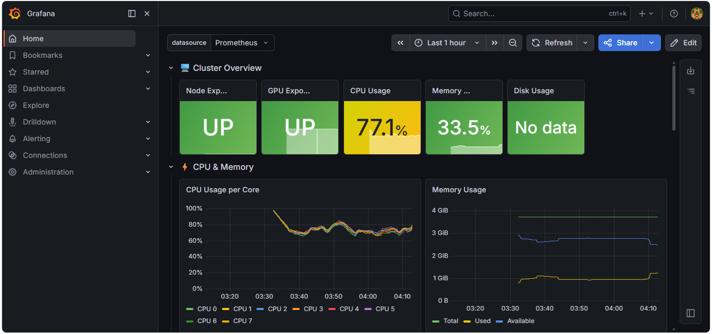
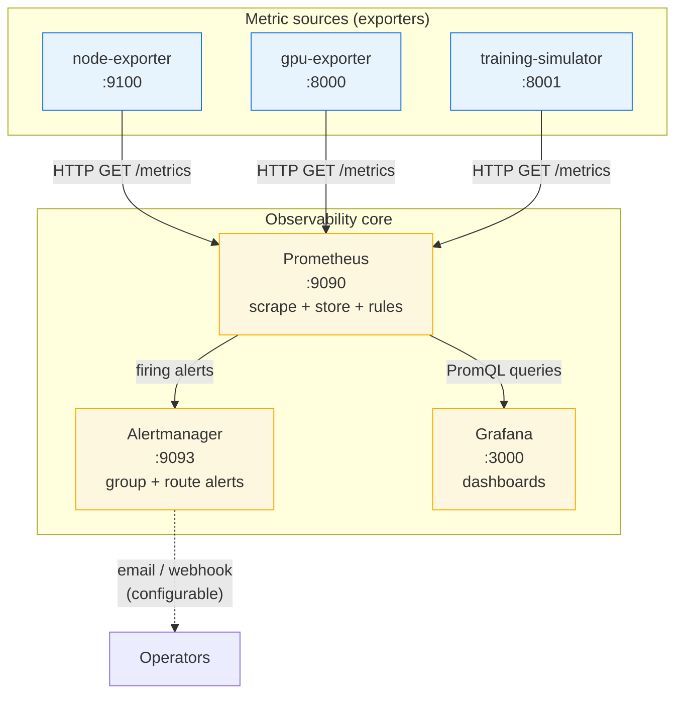

# AI Infrastructure Monitoring Platform

A **production-style observability stack** for AI/ML training infrastructure. Collect host metrics, simulated GPU telemetry, and training-job signals; store them in **Prometheus**; visualize in **Grafana**; and route alerts through **Alertmanager**.

**No physical GPU required** — four GPUs and a BERT-style training job are simulated for demos, portfolios, and local development.

---

## Dashboard Preview



---

## Table of Contents

- [Features](#features)
- [Architecture](#architecture)
- [Port Reference](#port-reference)
- [Prerequisites](#prerequisites)
- [Run Locally](#run-locally)
- [Access the Stack](#access-the-stack)
- [What Gets Monitored](#what-gets-monitored)
- [Alert Rules](#alert-rules)
- [Project Structure](#project-structure)
- [Configuration](#configuration)
- [Troubleshooting](#troubleshooting)
- [Resume / Portfolio Highlights](#resume--portfolio-highlights)
- [License](#license)

---

## Features

- **End-to-end monitoring** — exporters → Prometheus → Grafana + Alertmanager
- **Custom Python exporters** — Prometheus text format on HTTP `/metrics`
- **Simulated 4× GPU cluster** — utilization, memory, temperature, power, clocks
- **Training job simulator** — loss, accuracy, learning rate, gradient norm, throughput
- **11 pre-built alert rules** — node health, resource pressure, GPU thermal, training anomalies
- **Dashboards-as-code** — Grafana datasource + dashboard auto-provisioned on startup
- **Docker Compose** — one command to run the full stack locally

---

## Architecture

### High-level flow

Metrics are **pulled (scraped)** by Prometheus every 15 seconds. Grafana queries Prometheus. When alert rules fire, Prometheus sends notifications to Alertmanager.



### ASCII overview (same system)

```
┌──────────────────────────────────────────────────────────────────────────┐
│                         Your machine (Docker host)                        │
│                                                                           │
│   ┌──────────────┐  ┌──────────────┐  ┌──────────────────┐             │
│   │ node-exporter│  │ gpu-exporter │  │ training-simulator│             │
│   │    :9100     │  │    :8000     │  │      :8001        │             │
│   │ CPU/RAM/Disk │  │ 4× GPU sim   │  │ loss/acc/LR/...   │             │
│   └──────┬───────┘  └──────┬───────┘  └────────┬─────────┘             │
│          │                 │                    │                        │
│          └─────────────────┴────────────────────┘                        │
│                            │ scrape every 15s                            │
│                   ┌────────▼────────┐                                    │
│                   │    Prometheus    │ :9090                             │
│                   │  TSDB + rules    │                                    │
│                   └────────┬────────┘                                    │
│              ┌───────────────┼───────────────┐                             │
│              │               │               │                             │
│     ┌────────▼────────┐              ┌───────▼────────┐                    │
│     │  Alertmanager   │              │    Grafana     │                    │
│     │     :9093       │              │     :3000      │                    │
│     └─────────────────┘              └────────────────┘                    │
└──────────────────────────────────────────────────────────────────────────┘
```

### Why this design?

| Layer | Role |
|-------|------|
| **Exporters** | Small services that expose metrics in Prometheus format. Keeps instrumentation separate from apps. |
| **Prometheus** | Single source of truth for time-series data; evaluates alert rules on the same data. |
| **Grafana** | Human-friendly charts; does not store long-term metrics itself. |
| **Alertmanager** | Dedupes, groups, and routes alerts so on-call is not spammed. |

---

## Port Reference

All ports are published to **localhost** via `docker-compose.yml` (`host:container`).

| Port | Service | Protocol | Why this port? |
|------|---------|----------|----------------|
| **3000** | Grafana | HTTP | [Default Grafana port](https://grafana.com/docs/grafana/latest/setup-grafana/installation/docker/). Web UI for dashboards. |
| **9090** | Prometheus | HTTP | [Conventional Prometheus port](https://prometheus.io/docs/prometheus/latest/getting_started/). UI, PromQL, API, and config reload. |
| **9093** | Alertmanager | HTTP | [Default Alertmanager port](https://prometheus.io/docs/alerting/latest/alertmanager/). UI to see silences and alert groups. |
| **9100** | node-exporter | HTTP | [Official node_exporter default](https://github.com/prometheus/node_exporter). Standard for Linux host metrics in the Prometheus ecosystem. |
| **8000** | gpu-exporter | HTTP | Custom exporter (not an IANA standard). Chosen to avoid clashing with 9090/9100; exposes `/metrics` for GPU simulation. |
| **8001** | training-simulator | HTTP | Custom exporter. Adjacent to 8000 so GPU vs training endpoints are easy to remember and configure separately in Prometheus. |

### Internal vs external

- **From your browser:** use `localhost` and the ports above.
- **Inside Docker network:** Prometheus scrapes `node-exporter:9100`, `gpu-exporter:8000`, `training-simulator:8001` by service name — containers do not need to publish ports to each other, only to the host for debugging.

### Security note for GitHub / production

Default Grafana login is **`admin` / `admin123`**. Sign-up is disabled (`GF_USERS_ALLOW_SIGN_UP=false`). For anything beyond local demos, change the password and do not expose these ports to the public internet without authentication and TLS.

---

## Prerequisites

| Requirement | Notes |
|-------------|--------|
| **Docker** 20.10+ | [Docker Desktop](https://www.docker.com/products/docker-desktop/) on Windows/macOS |
| **Docker Compose** v2+ | Included with Docker Desktop (`docker compose version`) |
| **RAM** | 4 GB minimum recommended (8 GB host is comfortable) |
| **Disk** | ~2 GB for images + volumes |

No local Python virtual environment is required — Python dependencies are installed **inside** the exporter images at build time.

---

## Run Locally

### 1. Clone the repository

```bash
git clone https://github.com/TruptiKanade09/ai-infra-monitor.git
cd ai-infra-monitor
```

> **Important:** Run Compose from the folder that contains `docker-compose.yml` **and** the `exporters/` directory side by side.  
> If you extracted a zip twice, you may see `ai-infra-monitor/ai-infra-monitor/` — use the **inner** folder that has `exporters`, `prometheus`, and `grafana`.

Verify:

```bash
# Linux / macOS
ls docker-compose.yml exporters prometheus grafana

# Windows PowerShell
dir docker-compose.yml, exporters, prometheus, grafana
```

### 2. Start the stack

```bash
docker compose up -d
```

First run builds two images (`gpu-exporter`, `training-simulator`) and may take **2–5 minutes**.

### 3. Check containers

```bash
docker compose ps
```

All services should show **running**.

### 4. Open Grafana

| Field | Value |
|-------|--------|
| URL | http://localhost:3000 |
| Username | `admin` |
| Password | `admin123` |

There is **no registration page** — only login. That is intentional. After login you may skip or set a new password.

The **AI Infrastructure — Cluster Overview** dashboard is provisioned automatically.

### 5. Optional: Prometheus & Alertmanager UIs

| Service | URL |
|---------|-----|
| Prometheus | http://localhost:9090 |
| Alertmanager | http://localhost:9093 |

Example PromQL queries in Prometheus → **Graph**:

```promql
gpu_utilization_percent
training_loss
100 - (avg(rate(node_cpu_seconds_total{mode="idle"}[5m])) * 100)
```

---

## Run Locally (Windows PowerShell)

```powershell
# 1. Go to project root (adjust path after clone)
cd "C:\path\to\ai-infra-monitor"

# 2. Confirm layout
dir docker-compose.yml
dir exporters

# 3. Start
docker compose up -d

# 4. Status
docker compose ps
```

Open http://localhost:3000 and log in with `admin` / `admin123`.

**Common Windows issues:** ensure Docker Desktop is running (green whale icon); if build fails with *paging file too small*, close other apps, increase virtual memory, restart, then run `docker compose up -d` again.

---

## Access the Stack

| UI | URL | Purpose |
|----|-----|---------|
| Grafana | http://localhost:3000 | Dashboards & exploration |
| Prometheus | http://localhost:9090 | Targets, PromQL, alerts status |
| Alertmanager | http://localhost:9093 | Active alerts & silences |
| node-exporter metrics | http://localhost:9100/metrics | Raw host metrics |
| gpu-exporter metrics | http://localhost:8000/metrics | Raw GPU metrics |
| training-simulator metrics | http://localhost:8001/metrics | Raw training metrics |

---

## What Gets Monitored

| Category | Example metrics |
|----------|-----------------|
| **CPU** | Usage per core, load average, idle time |
| **Memory** | Total, used, available, swap |
| **Disk** | Usage %, read/write throughput |
| **Network** | Bytes RX/TX, errors per interface |
| **GPU (simulated)** | Utilization, memory, temperature, power, fan, SM clock |
| **Training job** | Train/val loss, accuracy, learning rate, gradient norm, steps/sec |

---

## Alert Rules

Defined in `prometheus/alert_rules.yml` (evaluated every 15s).

| Alert | Condition | Severity |
|-------|-----------|----------|
| NodeDown | `up == 0` for 1m | critical |
| HighCPUUsage | CPU > 90% for 5m | warning |
| HighMemoryUsage | Memory > 85% for 3m | warning |
| CriticalMemoryUsage | Memory > 95% for 1m | critical |
| DiskSpaceLow | Disk < 15% free | warning |
| DiskSpaceCritical | Disk < 5% free | critical |
| GPUHighTemperature | Temp > 85°C for 2m | warning |
| GPUCriticalTemperature | Temp > 95°C for 30s | critical |
| GPUMemoryHigh | GPU mem > 90% for 5m | warning |
| TrainingJobPossiblyFailed | GPU was >70%, now <10% for 3m | critical |
| TrainingJobStuck | No training steps for 5m | critical |

---

## Project Structure

```
ai-infra-monitor/
├── docker-compose.yml          # All services, ports, env vars
├── prometheus/
│   ├── prometheus.yml          # Scrape jobs + alertmanager target
│   └── alert_rules.yml         # Recording & alerting rules
├── alertmanager/
│   └── alertmanager.yml        # Route/group/inhibit config
├── grafana/
│   └── provisioning/
│       ├── datasources/        # Prometheus datasource (auto)
│       └── dashboards/         # Cluster overview JSON
├── exporters/
│   ├── gpu_exporter.py         # Simulated GPU metrics
│   ├── training_simulator.py   # Training metrics + CPU load
│   ├── Dockerfile.gpu
│   └── Dockerfile.training
└── scripts/
    └── setup_multinode.sh      # Optional Multipass cluster (Linux/macOS)
```

---

## Configuration

| Variable | Service | Default | Description |
|----------|---------|---------|-------------|
| `SIMULATION_MODE` | gpu-exporter | `true` | Use simulated GPU data |
| `GPU_COUNT` | gpu-exporter | `4` | Number of simulated GPUs |
| `JOB_NAME` | training-simulator | `bert-finetuning` | Label for training job |
| `EPOCHS` | training-simulator | `100` | Simulated epoch count |
| `GF_SECURITY_ADMIN_USER` | grafana | `admin` | Admin username |
| `GF_SECURITY_ADMIN_PASSWORD` | grafana | `admin123` | Admin password |

### Use a real NVIDIA GPU (optional)

1. Install `pynvml` in the exporter image or host.
2. In `exporters/gpu_exporter.py`, enable the `pynvml` code paths.
3. Set `SIMULATION_MODE=false` in `docker-compose.yml`.
4. Rebuild: `docker compose up -d --build`.

### Multi-node cluster (optional)

See `scripts/setup_multinode.sh` (requires [Multipass](https://multipass.run)). Uncomment the `worker-nodes` job in `prometheus/prometheus.yml` after VMs are running.

---

## Troubleshooting

| Problem | Fix |
|---------|-----|
| `exporters` path not found | `cd` into the folder that contains both `docker-compose.yml` and `exporters/` |
| `paging file too small` (Windows) | Free RAM, increase virtual memory, restart Docker Desktop |
| Port already in use | Stop the other app or change host ports in `docker-compose.yml` |
| Grafana login only, no sign-up | Expected — use `admin` / `admin123` |
| Empty Grafana panels | Wait 1–2 minutes for first scrape; check http://localhost:9090/targets — all targets should be **UP** |

### Useful commands

```bash
docker compose ps
docker compose logs -f
docker compose logs gpu-exporter
docker compose down          # stop, keep data volumes
docker compose down -v       # stop and wipe Prometheus/Grafana data
docker compose up -d --build # rebuild after code changes
```

---

## Resume / Portfolio Highlights

Copy/adapt for LinkedIn, resume, or README:

- Designed and deployed an **observability platform** for AI training infrastructure using **Prometheus**, **Grafana**, and **Alertmanager** with **Docker Compose**.
- Built **custom Python exporters** exposing GPU utilization, memory, temperature, power, and ML training metrics (loss, accuracy, gradient norms) in **Prometheus exposition format**.
- Implemented **11 alert rules** for node failures, resource exhaustion, GPU thermal limits, and training-job anomaly detection.
- Simulated realistic **multi-GPU** and **training workloads** without dedicated hardware for reproducible demos.
- Delivered **Grafana dashboards-as-code** with 20+ panels covering infrastructure and training lifecycle metrics.

---

## Tech Stack


---

## License

MIT — see [LICENSE](LICENSE) if present, or add your preferred license before publishing.

---

## Author

**Trupti Gajendra Kanade** — [@TruptiKanade09](https://github.com/TruptiKanade09)

If this project helped you, consider giving the repo a star.
